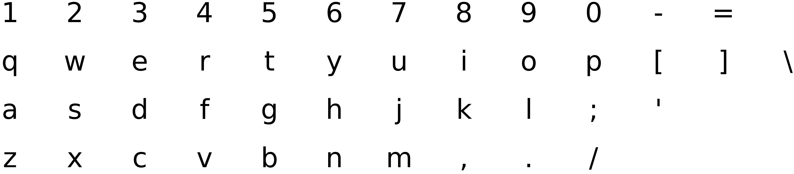
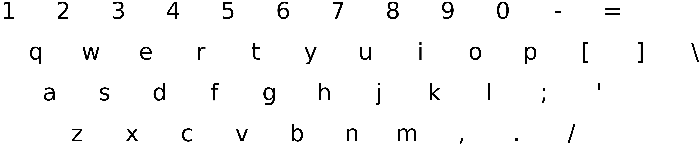

<div align="center">
  <h1>clavier</h1>
  <q><i>Measuring distance between keyboard characters.</i></q>
</div>
<br>

<div align="center">
  <!-- Tests -->
  <a href="https://github.com/MaxHalford/clavier/actions/workflows/unit-tests.yml">
    
  </a>
  <!-- License -->
  <a href="https://opensource.org/licenses/MIT">
    
  </a>
</div>
<br>

## Table of contents

- [Table of contents](#table-of-contents)
- [Introduction](#introduction)
- [Installation](#installation)
- [User guide](#user-guide)
  - [Keyboard layouts](#keyboard-layouts)
  - [Distance between characters](#distance-between-characters)
  - [Distance between words](#distance-between-words)
  - [Typing distance](#typing-distance)
  - [Physical layout specification](#physical-layout-specification)
    - [Staggering](#staggering)
    - [Key pitch](#key-pitch)
  - [Drawing a keyboard layout](#drawing-a-keyboard-layout)
  - [Custom layouts](#custom-layouts)
    - [The `from_coordinates` method](#the-from_coordinates-method)
    - [The `from_grid` method](#the-from_grid-method)
- [Development](#development)
- [License](#license)

## Introduction

Default [edit distances](https://www.wikiwand.com/en/Edit_distance), such as the [Levenshtein distance](https://www.wikiwand.com/en/Levenshtein_distance), don't differentiate between characters. The distance between two characters is either 0 or 1. This package allows you to measure edit distances by taking into account keyboard layouts.

The scope is purposefully limited to alphabetical, numeric, and punctuation keys. That's because this package is meant to assist in analyzing user inputs -- e.g. for [spelling correction](https://norvig.com/spell-correct.html) in a search engine.

The goal of this package is to be flexible. You can define any [logical layout](https://deskthority.net/wiki/Keyboard_layouts#Logical_layout), such as QWERTY or AZERTY. You can also control the [physical layout](https://deskthority.net/wiki/Physical_keyboard_layout) by defining where the keys are on the board.

## Installation

```sh
pip install git+https://github.com/MaxHalford/clavier
```

## User guide

### Keyboard layouts

☝️ Things are a bit more complicated than QWERTY vs. AZERTY vs. XXXXXX. Each layout has many variants. I haven't yet figured out a comprehensive way to map all these out.

This package provides a list of keyboard layouts. For instance, we'll load the [QWERTY](https://www.wikiwand.com/en/QWERTY) keyboard layout.

```py
>>> import clavier
>>> keyboard = clavier.load_qwerty()
>>> keyboard
1 2 3 4 5 6 7 8 9 0 - =
q w e r t y u i o p [ ] \
a s d f g h j k l ; '
z x c v b n m , . /

>>> keyboard.shape
(4, 13)

>>> len(keyboard)
46

```

Here is the list of currently available layouts:

```py
>>> for layout in (member for member in dir(clavier) if member.startswith('load_')):
...     print(layout.replace('load_', ''))
...     exec(f'print(clavier.{layout}())')
...     print('---')
dvorak
` 1 2 3 4 5 6 7 8 9 0 [ ]
' , . p y f g c r l / = \
a o e u i d h t n s -
; q j k x b m w v z
---
qwerty
1 2 3 4 5 6 7 8 9 0 - =
q w e r t y u i o p [ ] \
a s d f g h j k l ; '
z x c v b n m , . /
---

```

### Distance between characters

Measure the Euclidean distance between two characters on the keyboard.

```py
>>> keyboard.char_distance('1', '2')
1.0

>>> keyboard.char_distance('q', '2')
1.4142135623730951

>>> keyboard.char_distance('1', 'm')
6.708203932499369

```

### Distance between words

Measure a modified version of the [Levenshtein distance](https://www.wikiwand.com/en/Levenshtein_distance), where the substitution cost is the output of the `char_distance` method.

```py
>>> keyboard.word_distance('apple', 'wople')
2.414213562373095

>>> keyboard.word_distance('apple', 'woplee')
3.414213562373095

```

You can also override the deletion cost by specifying the `deletion_cost` parameter, and the insertion cost via the `insertion_cost` parameter. Both default to 1.

### Typing distance

Measure the sum of distances between each pair of consecutive characters. This can be useful for studying [keystroke dynamics](https://www.wikiwand.com/en/Keystroke_dynamics).

```py
>>> keyboard.typing_distance('hello')
10.245040190466598

```

For sentences, you can split them up into words and sum the typing distances.

```py
>>> sentence = 'the quick brown fox jumps over the lazy dog'
>>> sum(keyboard.typing_distance(word) for word in sentence.split(' '))
105.60457487263012

```

Interestingly, this can be used to compare keyboard layouts in terms of efficiency. For instance, the [Dvorak](https://www.wikiwand.com/en/Dvorak_keyboard_layout) keyboard layout is supposedly more efficient than the QWERTY layout. Let's compare both on the first stanza of [If—](https://www.wikiwand.com/en/If%E2%80%94) by Rudyard Kipling:

```py
>>> stanza = """
... If you can keep your head when all about you
...    Are losing theirs and blaming it on you;
... If you can trust yourself when all men doubt you,
...    But make allowance for their doubting too;
... If you can wait and not be tired by waiting,
...    Or, being lied about, don't deal in lies,
... Or, being hated, don't give way to hating,
...    And yet don't look too good, nor talk too wise;
... """

>>> words = list(map(str.lower, stanza.split()))

>>> qwerty = clavier.load_qwerty()
>>> sum(qwerty.typing_distance(word) for word in words)
740.3255229138255

>>> dvorak = clavier.load_dvorak()
>>> sum(dvorak.typing_distance(word) for word in words)
923.6597116104518

```

It seems the Dvorak layout is in fact slower than the QWERTY layout. But of course this might not be the case in general.

### Physical layout specification

By default, the keyboard layouts are [ortholinear](https://deskthority.net/wiki/Staggering#Matrix_layout), meaning that the characters are physically arranged over a grid. You can customize the physical layout to make it more realistic and thus obtain distance measures which are closer to reality. This can be done by specifying parameters to the keyboards when they're loaded.

#### Staggering

[Staggering](https://deskthority.net/wiki/Staggering) is the amount of offset between two consecutive keyboard rows.

You can specify a constant staggering as so:

```py
>>> keyboard = clavier.load_qwerty(staggering=0.5)

```

By default the keys are spaced by 1 unit. So a staggering value of 0.5 implies a 50% horizontal shift between each pair of consecutive rows. You may also specify a different amount of staggering for each pair of rows:

```py
>>> keyboard = clavier.load_qwerty(staggering=[0.5, 0.25, 0.5])

```

There's 3 elements in the list because the keyboard has 4 rows.

#### Key pitch

[Key pitch](https://deskthority.net/wiki/Unit) is the amount of distance between the centers of two adjacent keys. Most computer keyboards have identical horizontal and vertical pitches, because the keys are all of the same size width and height. But this isn't the case for mobile phone keyboards. For instance, iPhone keyboards have a higher vertical pitch.

### Drawing a keyboard layout

```py
>>> keyboard = clavier.load_qwerty()
>>> ax = keyboard.draw()
>>> ax.get_figure().savefig('img/qwerty.png', bbox_inches='tight')

```



```py
>>> keyboard = clavier.load_qwerty(staggering=[0.5, 0.25, 0.5])
>>> ax = keyboard.draw()
>>> ax.get_figure().savefig('img/qwerty_staggered.png', bbox_inches='tight')

```



### Custom layouts

You can of course specify your own keyboard layout. There are different ways to do this. We'll use the iPhone keypad as an example.

#### The `from_coordinates` method

```py
>>> keypad = clavier.Keyboard.from_coordinates({
...     '1': (0, 0), '2': (0, 1), '3': (0, 2),
...     '4': (1, 0), '5': (1, 1), '6': (1, 2),
...     '7': (2, 0), '8': (2, 1), '9': (2, 2),
...     '*': (3, 0), '0': (3, 1), '#': (3, 2),
...                  '☎': (4, 1)
... })
>>> keypad
1 2 3
4 5 6
7 8 9
* 0 #
  ☎

```

#### The `from_grid` method

```py
>>> keypad = clavier.Keyboard.from_grid("""
...     1 2 3
...     4 5 6
...     7 8 9
...     * 0 #
...       ☎
... """)
>>> keypad
1 2 3
4 5 6
7 8 9
* 0 #
  ☎

```

## Development

```sh
git clone https://github.com/MaxHalford/clavier
cd clavier
pip install poetry
poetry install
poetry shell
pytest
```

## License

The MIT License (MIT). Please see the [license file](LICENSE) for more information.
